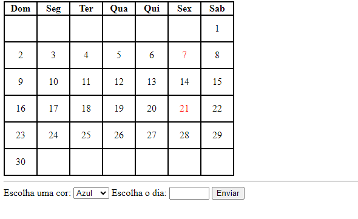

# Indice

[Projeto de portifolio pessoal](https://github.com/donavanrenan/calendario#projeto-de-portf%C3%B3lio)  
[Descriação](https://github.com/donavanrenan/calendario#descria%C3%A7%C3%A3o)  
[Funcionalidades](#funcionalidades)  
[Tecnologias utilizadas](#tecnologias-utilizadas)  
[fontes consultadas](#fontes-consultadas)  
[Autores](#autores)  

# Projeto escrita do README

## Descriação
o propósito deste projeto, o objetivo, ajudar o usuario com datas.

## Introdução
o calendario é uma ferramenta muito empostante para se organisar, e não perder datas empostantes por acidente.

## Funcionalidades
utilizados para marcar data = aniversario, data especial, compromisso, feriado...

### tecnologias utilizadas 
visual estudio code
git hub

## fontes consultadas
https://gist.github.com/lohhans/f8da0b147550df3f96914d3797e9fb89
https://www.alura.com.br/artigos/escrever-bom-readme

## Autores
